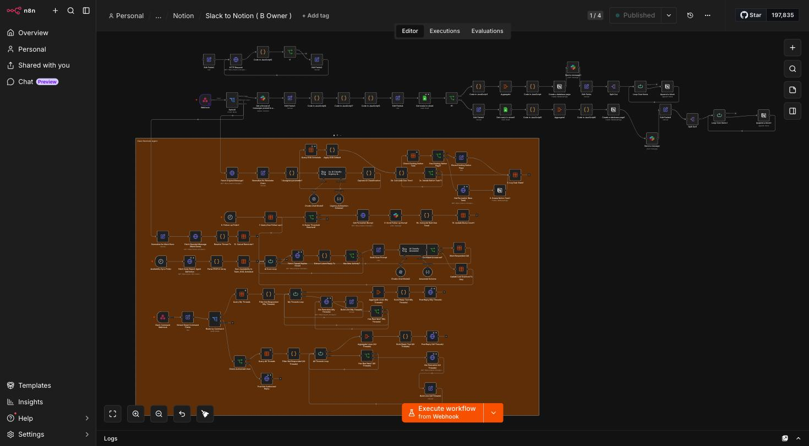
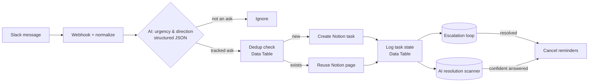
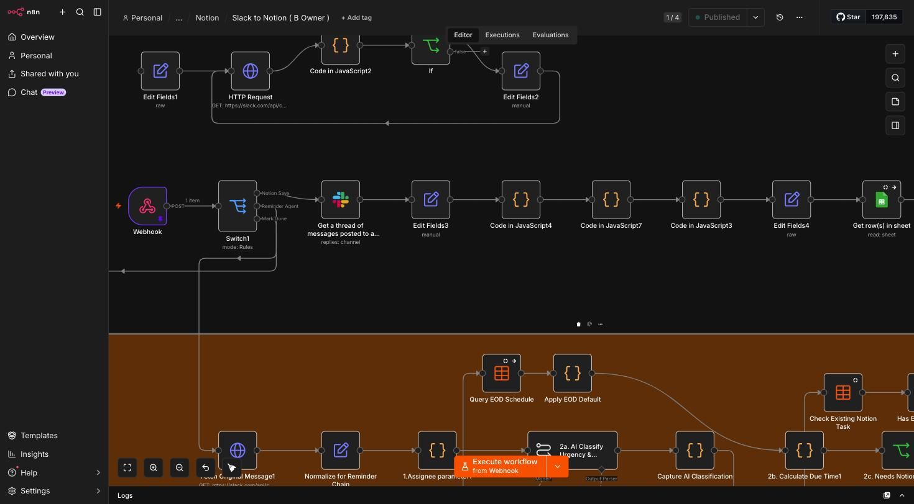
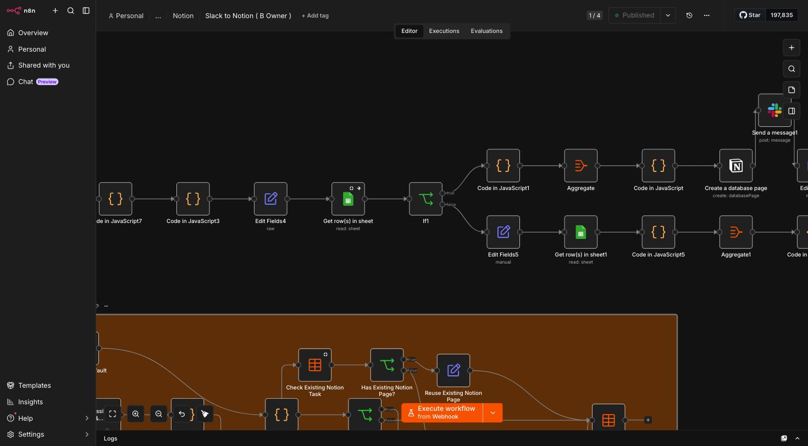
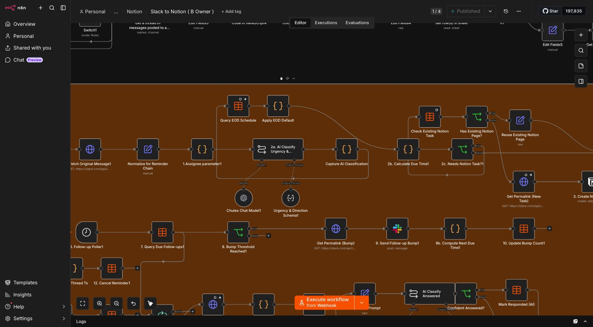
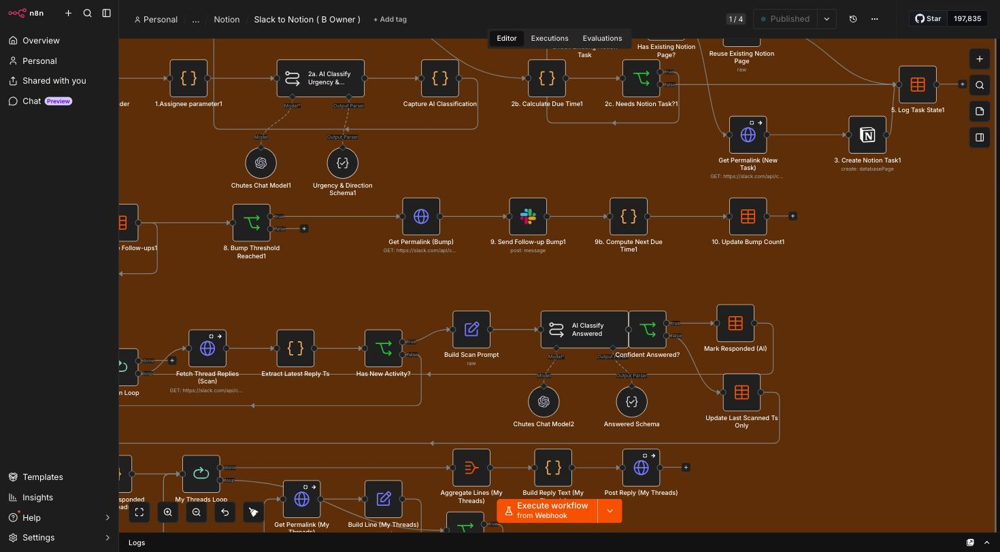
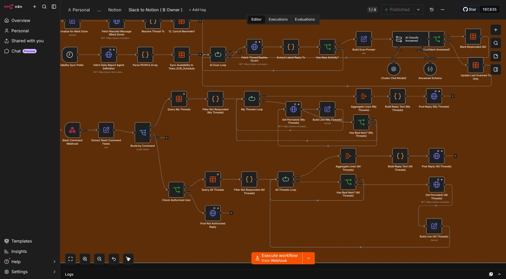
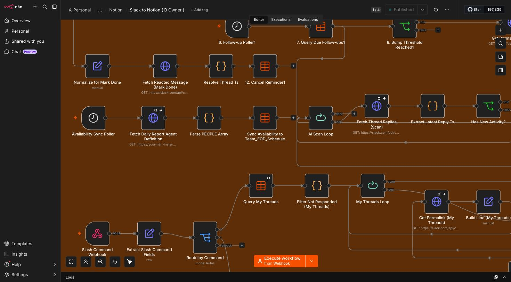

# CERBERUS

### An AI-driven Slack accountability & escalation engine — so nothing said in a channel quietly dies.

> In myth, Cerberus is the many-headed hound that guards the gate: nothing gets past it unnoticed, and nothing escapes. This project is named for the same job. It watches every message that asks something of someone, decides whether it deserves to be tracked, opens a durable record, chases it with escalating reminders until it is handled, and — using a second, independent AI pass — notices on its own when a thread has actually been resolved. Nothing important slips through. Nothing important escapes.

CERBERUS is a **102-node [n8n](https://n8n.io) workflow** that turns an ordinary Slack channel into an accountable work queue. It is *not* a "Slack → Notion sync." It is an autonomous triage-and-follow-up system that uses a large language model **twice** — once to judge urgency at intake, once to detect resolution on a schedule — with [n8n Data Tables](https://docs.n8n.io/data/data-tables/) as its state store and Notion as the durable task record.

---

## Table of Contents

- [The Problem](#the-problem)
- [What CERBERUS Does](#what-cerberus-does)
- [System Overview](#system-overview)
- [Architecture](#architecture)
  - [1. Ingestion & AI Classification](#1--ingestion--ai-classification)
  - [2. Notion Task Creation & Deduplication](#2--notion-task-creation--deduplication)
  - [3. Escalation / Follow-up Engine](#3--escalation--follow-up-engine)
  - [4. AI Resolution Scanner](#4--ai-resolution-scanner)
  - [5. Slash-Command Interface](#5--slash-command-interface)
  - [6. EOD / Availability Sync](#6--eod--availability-sync)
  - [7. Supporting Infrastructure](#7--supporting-infrastructure)
- [Technology Stack](#technology-stack)
- [Notable Engineering Decisions](#notable-engineering-decisions)
- [Setup / What You'd Need](#setup--what-youd-need)
- [License](#license)

---

## The Problem

Every team lives this: someone asks a real question in a busy Slack channel — *"can you approve this?"*, *"who's covering the deploy tonight?"*, *"is the client blocker resolved?"* — and then the message scrolls away. There is no owner, no due date, and no memory. The channel is a river, not a ledger. Important asks die quietly, and the only "system" holding them is whoever happens to remember.

The usual fixes don't hold:

- **Manual task creation** depends on a human copying the message into a tracker — which is exactly the discipline that fails under load.
- **Naïve "sync every message to a tracker"** buries the signal: now you have a tracker full of noise, *"lol nice"* included, and still no accountability.
- **Reminder bots** nag on a fixed timer and have no idea whether the thing was already handled, so people learn to ignore them.

CERBERUS attacks the actual gap: **judgment and persistence.** It decides *which* messages are real asks, gives each one a durable record and an owner, escalates on a schedule until it's dealt with, and — the hard part — figures out **on its own** when a thread has been answered so it can stop chasing, without a human ever clicking "done."

---

## What CERBERUS Does

1. **Listens** to Slack events through a webhook and normalizes each incoming message.
2. **Classifies** every message with an LLM: *is this an ask? how urgent? who is it directed at?* — returning a strict, schema-validated JSON verdict.
3. **Opens a tracked task** in Notion for messages that warrant one — deduplicating against a state table so the same thread never spawns two records.
4. **Escalates** unanswered tasks with cron-driven, count-aware reminder "bumps" that grow more insistent the longer a task sits.
5. **Detects resolution automatically** with a *second, independent* LLM pass that reads new thread replies and decides whether the ask now looks answered — then closes its own loop.
6. **Answers on demand** via a Slack slash command that renders a live digest of open threads, gated by an admin allowlist.
7. **Keeps its roster current** by pulling a shared "PEOPLE" definition from a separate configuration workflow and syncing an end-of-day default-routing table.

---

## System Overview

The full workflow — 102 nodes across seven cooperating subsystems, framed by the "Slack Reminder Agent" annotation on the canvas:

At a glance, the message lifecycle looks like this:

Two independent scheduled loops run alongside intake — one that **chases** open tasks and one that **watches** for them to be resolved — which is what lets the system open *and close* its own loops.

---

## Architecture

CERBERUS is organized into seven subsystems. Each screenshot below is a real, legible view of that region of the live workflow canvas (infrastructure identifiers redacted).

### 1 · Ingestion & AI Classification

A **Webhook** node receives Slack events. A **Switch** (`mode: Rules`) fans the event into distinct intents — *save to Notion*, *reminder-agent handling*, *mark-done* — and a chain of **Code** (JavaScript) and **Set** nodes normalize the raw Slack payload into a clean, predictable shape (message text, author, thread timestamp, channel). A raw **HTTP Request** to `slack.com/api/...` enriches the event with thread context where needed.

The normalized message then hits **`2a. AI Classify Urgency & Direction`** — an `@n8n/n8n-nodes-langchain.chainLlm` node backed by the **Chutes Chat Model** (`gpt-4.1-mini`, served over Chutes' OpenAI-compatible inference API). Crucially, it is wired to an **`outputParserStructured`** node ("Urgency & Direction Schema") that *forces* the model to return strict JSON — urgency, direction, whether it's an actionable ask — instead of free-form prose. Downstream logic can then branch on typed fields rather than parsing English. A **`2c. Needs Notion Task?`** gate decides whether this message earns a tracked record at all, which is the filter that keeps the tracker signal-dense.

### 2 · Notion Task Creation & Deduplication

Before creating anything, **`Check Existing Notion Task`** (an n8n **Data Table** lookup) asks *have we already opened a record for this thread?* A **`Has Existing Notion Page?`** branch then either **reuses the existing Notion page** or creates a fresh one via the **Notion** node ("Create a database page"), with an **Append a block** step writing the message content into the page body. A **Google Sheet** acting as a roster/reference source is read alongside this path to enrich task metadata, and a **Send message** step posts confirmation back to Slack.

This dedup-before-create discipline is what prevents the classic automation failure mode where every reply in a thread spawns a new "task."

### 3 · Escalation / Follow-up Engine

This is a small **state machine** built entirely on Data Tables and a cron trigger:

- **`5. Log Task State`** persists each task's state (owner, due time, bump count) to a Data Table.
- **`6. Follow-up Poller`** — a `scheduleTrigger` (cron) — wakes on an interval and hands off to **`7. Query Due Follow-ups`**, which reads the Data Table for tasks that are now due for a nudge.
- **`8. Bump Threshold Reached`** (an `if`) branches on *how many* reminders a task has already received.
- **`9. Send Follow-up Bump`** posts an escalating reminder into Slack (with **`Get Permalink (Bump)`** deep-linking back to the original message), and **`10. Update Bump Count`** increments the counter in the Data Table.
- **`12. Cancel Reminder`** stops the loop once the task is resolved.

`Apply EOD Default` / `Query EOD Schedule` supply end-of-day default routing when no one is explicitly assigned — so an unowned task still lands on someone by close of business rather than falling through.

### 4 · AI Resolution Scanner

This is the clever heart of the system, and a *separate* scheduled loop from the escalator. An **`AI Scan Loop`** (`splitInBatches`) walks each open thread:

1. **`Fetch Thread Replies (Scan)`** pulls the thread's latest replies via Slack's `conversations.replies` HTTP API.
2. **`Has New Activity?`** gates on whether anything new has been said since the last scan (cheap check before spending a model call).
3. **`Build Scan Prompt`** assembles the thread context, and **`AI Classify Answered`** — a second `chainLlm` backed by **Chutes Chat Model2** (`gpt-4.1-mini`) with its own **`Answered Schema`** structured parser — returns a typed verdict on whether the ask now looks resolved.
4. **`Confident Answered?`** gates on that verdict: if confident, **`Mark Responded (AI)`** closes the loop in the Data Table; otherwise **`Update Last Scanned Ts Only`** records progress and moves on.

The payoff: **CERBERUS closes its own loops.** No human has to remember to mark anything "done" — the system reads the room and decides.

### 5 · Slash-Command Interface

A dedicated **Slash Command Webhook** lets anyone pull a live digest on demand. **`Extract Slash Command Fields`** parses the command, and **`Route by Command`** (a `switch`) branches into *my threads* vs *all threads*. **`Query My Threads`** / **`Query All Threads`** read the Data Table, and an **admin allowlist check** (`Check Authorized User`) restricts the "all threads" view to a specific authorized Slack user — anyone else hits **`Post Not Authorized Reply`**.

For each open thread the system fans out through a loop — **`Get Permalink`** (Slack `chat.getPermalink`), **`Build Line`**, **`Has Real Item?`**, **`Aggregate Lines`**, **`Build Reply Text`** — and **`Post Reply`** renders a clean, formatted digest of open threads straight back into Slack.

### 6 · EOD / Availability Sync

An **`Availability Sync Poller`** (`scheduleTrigger`) keeps the team roster fresh using a neat self-referential pattern: **`Fetch Daily Report Agent Definition`** is an `httpRequest` that calls **n8n's own REST API** to fetch a *separate configuration workflow's* JSON, purely to extract a shared **"PEOPLE"** roster embedded inside it. **`Parse PEOPLE Array`** (Code) unpacks that roster and **`Sync Availability to Team_EOD_Schedule`** writes it into the Data Table that drives end-of-day default routing.

This treats team-roster data as *configuration living in a workflow*, decoupled from CERBERUS's automation logic — change the roster in one place and every downstream default-routing decision updates.

### 7 · Supporting Infrastructure

Woven through all six subsystems:

- **n8n Data Tables** (11 nodes) are the system's entire persistence layer — task state, bump counts, EOD schedule, scan timestamps — with no external database.
- **Code** (20), **Set** (14), **If** (10), **Switch** (2), **Aggregate** (4), **Split Out** (2) and **Split In Batches** (5) nodes handle all data shaping, branching, and looping.
- A single large **sticky note** ("Slack Reminder Agent") documents the canvas in place.

**Node census (102 total):** 20 Code · 14 Set · 12 HTTP Request · 11 Data Table · 10 If · 5 Split-In-Batches · 5 Notion · 4 Slack · 4 Aggregate · 2 Webhook · 2 Switch · 2 Split-Out · 2 Schedule Trigger · 2 Google Sheets · 2 Structured Output Parser · 2 OpenAI-compatible Chat Model · 2 LLM Chain · 1 Sticky Note.

---

## Technology Stack

| Technology | Role in CERBERUS | Why it's used |
|---|---|---|
| **n8n** (self-hosted) | Workflow orchestration engine hosting all 102 nodes | Visual, node-based automation with first-class webhooks, scheduling, branching and looping — the whole system is one maintainable canvas rather than a bespoke service. |
| **n8n Data Tables** | State store: task state, bump counts, EOD schedule, scan cursors | A lightweight, *embedded* datastore built into n8n — persistence without provisioning, securing, and paying for an external database. |
| **Slack API — Events / Webhooks** | Ingesting messages and slash commands | The event side feeds intake; the slash-command webhook powers the on-demand digest. |
| **Slack API — Web API (raw HTTP)** | `conversations.replies`, `chat.getPermalink`, `chat.postMessage` | Called via raw **HTTP Request** nodes for precise control over thread reading, deep-linking, and posting escalations/digests. |
| **Notion API** (`n8n-nodes-base.notion`) | Durable task record — create database page, append block | Notion is the human-facing ledger: every tracked ask becomes a real, browsable page with the message content in its body. |
| **Google Sheets API** | Secondary roster / reference source | A familiar, editable surface for reference data that non-engineers can maintain. |
| **LangChain-in-n8n** (`@n8n/n8n-nodes-langchain`) | `chainLlm` + `lmChatOpenAi` + `outputParserStructured` | Runs the two classification steps and — critically — **forces structured JSON output** so downstream logic branches on typed fields, not scraped English. |
| **Chutes** (OpenAI-compatible inference) | Serves `gpt-4.1-mini` for both classifiers | An OpenAI-compatible endpoint means the model is swappable via standard config; `gpt-4.1-mini` is fast and cheap enough to run on every inbound message and every scan tick. |
| **JavaScript** (n8n Code nodes) | Payload normalization and custom transforms | Twenty Code nodes do the glue work — reshaping Slack payloads, parsing rosters, building digest text — that declarative nodes can't. |
| **Cron / schedule triggers** | The follow-up poller and the availability-sync poller | Time-based wake-ups are what turn a request/response automation into a *persistent* agent that keeps chasing and watching. |
| **n8n REST API (self-referential call)** | Fetches a separate config workflow to extract the shared roster | Config-as-a-workflow: roster data lives in one place and is pulled at runtime instead of duplicated. |

---

## Notable Engineering Decisions

**1. Data Tables as a lightweight embedded datastore — no external DB.**
Every piece of durable state (task records, bump counts, EOD schedule, last-scanned timestamps) lives in n8n **Data Tables**. That's eleven Data Table nodes doing the job an external Postgres/Redis would normally do — with zero extra infrastructure to provision, secure, back up, or pay for. For a system that has to *remember* things between runs, this keeps the entire footprint inside n8n and makes the workflow genuinely self-contained.

**2. The "AI twice" pattern — classify at intake, detect resolution on scan.**
Most AI-plus-automation projects use a model once, at the front door. CERBERUS uses two *independent* structured-output classifiers at opposite ends of the task lifecycle: one judges **urgency and direction** the moment a message arrives, the other periodically judges whether a thread has been **answered**. That second classifier is what lets the system **close its own loops** — it detects resolution from the actual conversation instead of waiting for a human to click "done." Both are constrained by `outputParserStructured` schemas, so their verdicts are typed JSON the workflow can branch on deterministically.

**3. Self-referential API call for shared roster config.**
The availability sync doesn't hard-code the team roster. It calls **n8n's own REST API** to fetch a *separate configuration workflow* and extracts a shared "PEOPLE" array from it. This is config-as-a-workflow: roster data is decoupled from automation logic and defined once, so updating the team in one workflow propagates to CERBERUS's default-routing decisions automatically.

---

## Setup / What You'd Need

This repository documents a private, production workflow; it intentionally ships **no credentials, endpoints, or exportable workflow JSON**. Conceptually, building something like CERBERUS requires:

- **An n8n instance** (self-hosted or cloud) recent enough to include the **Data Tables** feature and the LangChain node pack.
- **A Slack app** with:
  - Event subscriptions / an incoming webhook for messages,
  - a **slash command** pointed at a second webhook,
  - bot scopes along the lines of `chat:write`, `channels:history`, `groups:history`, `reactions:read`, and permission to call `conversations.replies` and `chat.getPermalink`.
- **A Notion integration token** with access to a database, for creating task pages and appending blocks.
- **An OpenAI-compatible LLM API key** (here, Chutes serving `gpt-4.1-mini`) for the two classification steps.
- **A Google service account / OAuth credential** if you use a Sheet as a reference source.
- **n8n Data Tables** for state — or your datastore of choice if you'd rather externalize it.

None of the above values are included here; they are configured inside the n8n instance itself.

---

## License

Released under the [MIT License](LICENSE). Copyright (c) 2026 `malibusinesseg-ship-it`.

---

CERBERUS is a personal portfolio case study. Screenshots are of the live n8n canvas with infrastructure identifiers, hostnames, and personal data redacted. No proprietary credentials or machine-readable workflow export are included in this repository.
